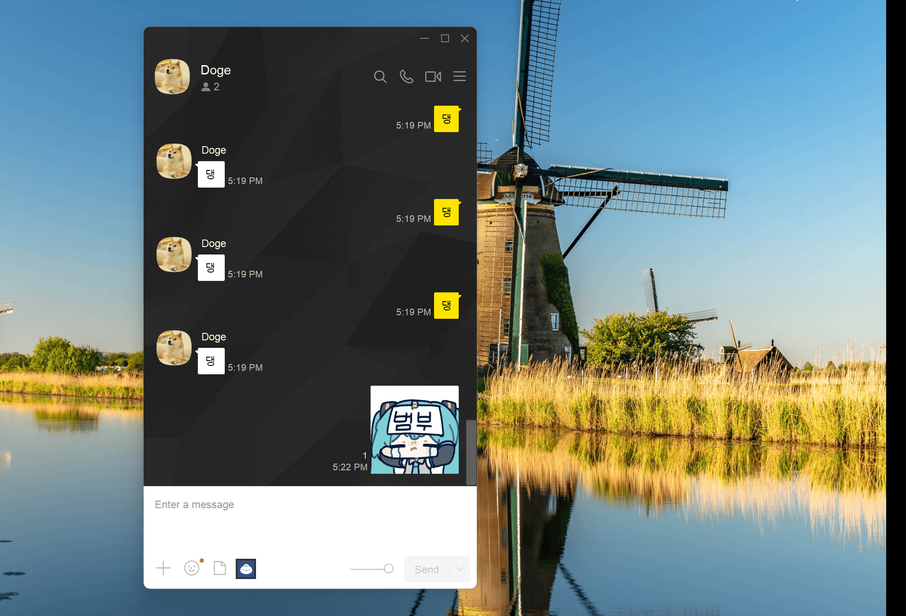

# 옐로우 인사이드 (Yellow Inside)

메신저에서 디시콘을 사용할 수 있게 해주는 Windows 앱입니다.

## 요구 사항

- Windows 10 이상

## 주요 기능

- 메신저 채팅창에 디시콘 버튼 자동 부착
- 디시콘 이미지 검색 및 전송
- 시작 프로그램 등록 지원

## 라이선스

이 프로젝트는 [MIT 라이선스](LICENSE.txt)로 배포됩니다.

## 면책 조항 (Disclaimer)

본 애플리케이션은 (주)카카오와 어떠한 제휴나 연관 관계도 없습니다. 본 애플리케이션은 메신저의 내부 코드를 수정하거나 역공학하지 않으며, Windows API를 통한 UI 후킹만을 사용하여 동작합니다. 이는 일반적인 Windows 자동화 기법의 범위 내에 해당합니다.

본 라이브러리의 사용이 메신저 서비스 이용약관에 부합하는지 여부는 사용자가 직접 확인해야 하며, 비공식 자동화 도구의 사용은 서비스 약관 위반으로 간주되어 계정 제재 등의 조치를 받을 수 있습니다. 본 라이브러리의 사용으로 발생하는 모든 결과에 대한 책임은 전적으로 사용자에게 있습니다.

## 감사의 글 (Acknowledgement)

이 프로젝트는 [GitHub Copilot](https://github.com/features/copilot)의 부분적인 도움으로 작성되었습니다.

## 작성자

**이호원** ([@airtaxi](https://github.com/airtaxi))
